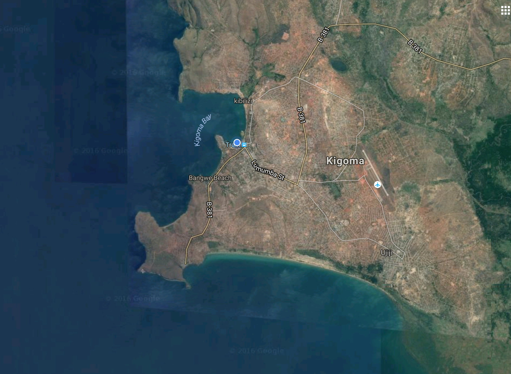

    
## The CLEAT Project - Funded by DANIDA and a collaboration between Aarhus University, TAFIRI, Illinois State University, and University of Dar es Salaam.         

The site will provide details and photos of the launch of the buoy on Lake Tanganyika. 

We are located at TAFIRI in Kigoma, Tanzania
 

 
*Kigoma Tanzania*

## November 29         
### Day 1 - The unpacking of the shipping container          
[Day 1](day1/buoy_day1.html)         

## November 30          
### Day 2 - Big Science - Cranes, Trucks, and Ships          
[Day 2](day2/buoy_day2.html)         

##December 1          
### Day 3 - Data loggers, anchors, and GPS surveys          
[Day 3](day3/buoy_day3.html)         

##December 2          
### Day 4 - Anchors away         
[Day 4](day4/buoy_day4.html)      

## December 3
### Day 5 - The last anchor goes in today - Stay tuned for updates.
[Day 5](day5/buoy_day5.html)   

## December 4
### Day 6 - A day to recover and prepare for Monday - Putting sensors on the buoy.
[Day 6](day6/buoy_day6.html)  

## December 5     
### Day 7 - Talk to the fishermen and put sensors on the buoy.      
[Day 7 Huruma and Sweki talking to the fishermen](day7bmu/buoy_day7bmu.html)             
     
[Day 7 putting the gear on the buoy](day7sensor/buoy_day7sensor.html)     
 

## December 6 - planning and not a day for photos.     

## December 7 - The unveiling of the buoy!     
      
[Day 9 Meetings](day9meet/buoy_day9meet.html)             
     
[Day 9 The Ribbon Cutting!!!](day9boat/buoy_day9boat.html)    

<!-- Global Site Tag (gtag.js) - Google Analytics -->

